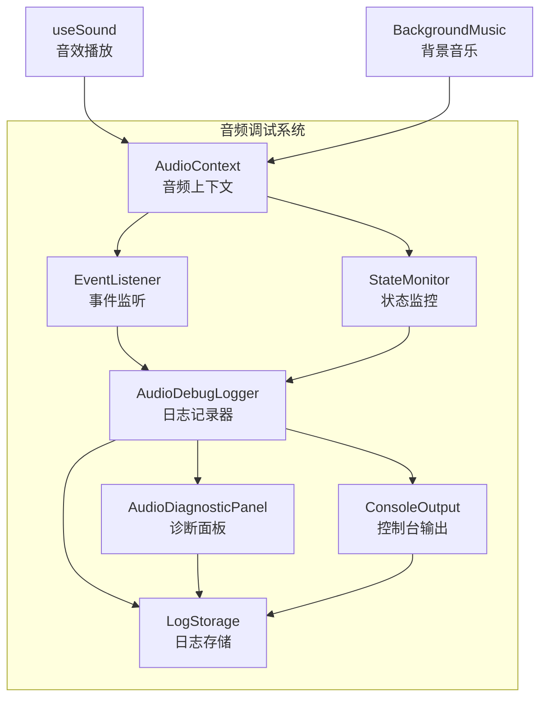
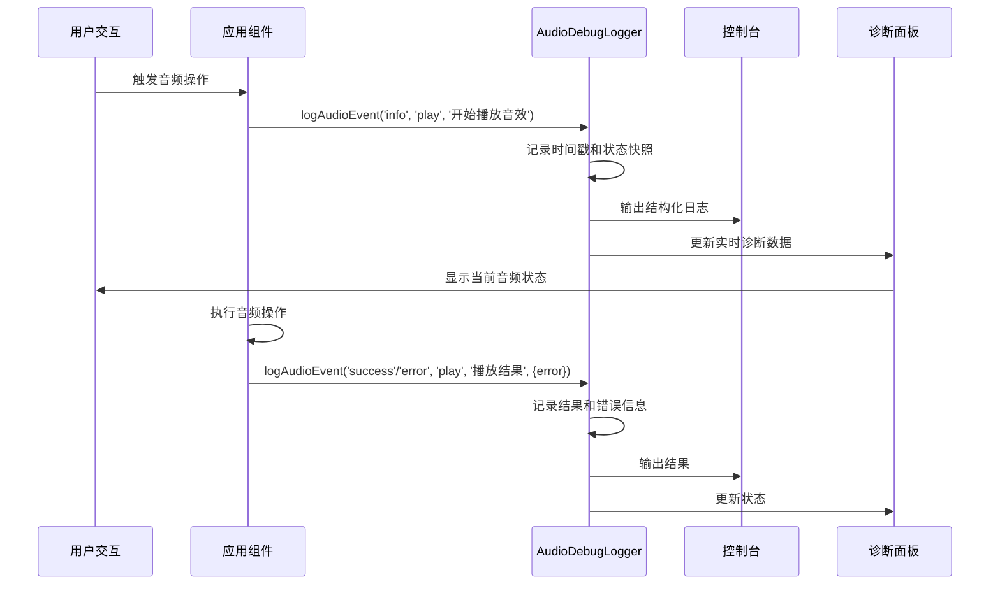

## 产品概述

为 iOS Safari 26.2 音频问题添加详细的调试日志和诊断工具，帮助定位无声问题的根本原因。现有代码已包含状态轮询、事件监听器扩展等兼容性修复，但缺少调试能力，无法定位具体问题原因（用户交互检测失败、AudioContext 恢复失败、音频节点创建失败等）。

## 核心功能

- 添加结构化音频调试日志系统，记录所有关键音频操作和状态变化
- 创建音频诊断工具，实时显示 AudioContext 状态、用户交互检测、音频节点状态等信息
- 在控制台输出详细调试信息，帮助定位问题根源
- 提供音频播放失败的错误堆栈和状态快照
- 记录音频相关的浏览器信息和环境参数

## 技术栈

- 框架：Vue 3 Composition API
- 构建工具：Vite 7.x
- 语言：JavaScript（无 TypeScript）
- 调试工具：原生 console API + 自定义日志系统

## 技术架构

### 系统架构



### 模块划分

**音频调试模块（src/utils/audioDebug.js）**

- 职责：提供统一的音频调试日志记录和诊断功能
- 关键技术：
- 日志级别系统（debug, info, warn, error）
- 音频操作追踪
- 状态快照记录
- 浏览器环境信息收集
- 依赖：无外部依赖
- 主要接口：
- `logAudioEvent(level, category, message, data)` - 记录音频事件
- `captureAudioState()` - 捕获当前音频状态
- `getAudioDiagnostics()` - 获取诊断信息
- `enableDebugMode()` - 启用调试模式
- `exportDebugLogs()` - 导出调试日志

**音频诊断面板组件（src/components/AudioDiagnosticPanel.vue）**

- 职责：实时显示音频诊断信息
- 关键技术：Vue 3 响应式数据、实时状态监听
- 依赖：audioDebug.js
- 主要功能：显示 AudioContext 状态、用户交互检测、最近的音频操作日志

### 数据流



## 实现细节

### 核心目录结构

```
src/
├── utils/
│   ├── audioDebug.js           # 新增：音频调试日志系统
│   ├── audioContext.js         # 修改：集成调试日志
│   └── audioSynthesis.js       # 修改：添加调试支持
├── composables/
│   └── useSound.js             # 修改：集成调试日志
├── components/
│   └── AudioDiagnosticPanel.vue  # 新增：音频诊断面板组件
└── config/
    └── constants.js            # 修改：添加调试相关常量
```

### 关键代码结构

**日志数据结构：**

```javascript
{
  id: string,          // 唯一日志ID
  timestamp: number,    // 时间戳
  level: string,        // 日志级别: 'debug', 'info', 'warn', 'error'
  category: string,    // 日志类别: 'context', 'play', 'user-interaction'
  message: string,     // 日志消息
  data: object,        // 附加数据
  state: object        // 音频状态快照
}
```

**音频状态快照：**

```javascript
{
  audioContext: {
    state: string,          // 'suspended', 'running', 'closed'
    sampleRate: number,
    baseLatency: number
  },
  userInteraction: {
    detected: boolean,
    firstInteractionTime: number,
    lastInteractionTime: number
  },
  environment: {
    userAgent: string,
    platform: string,
    isIOS: boolean,
    isSafari: boolean
  }
}
```

### 技术实现计划

**1. 创建音频调试日志系统**

- 问题：现有代码缺少调试信息，无法定位问题根源
- 解决方案：创建统一的调试日志系统，记录所有音频相关操作
- 关键技术：使用单例模式管理日志，提供结构化日志输出
- 实现步骤：

1. 创建 `audioDebug.js` 工具
2. 实现日志级别系统和格式化输出
3. 添加状态快照捕获功能
4. 集成浏览器环境信息收集

- 测试策略：在开发环境启用调试模式，验证日志输出格式和内容

**2. 集成调试日志到现有音频代码**

- 问题：需要在所有关键音频操作点添加日志
- 解决方案：在 audioContext.js、useSound.js 等文件中集成日志记录
- 关键技术：使用装饰器模式包装现有函数，最小化代码侵入
- 实现步骤：

1. 修改 audioContext.js，在 AudioContext 创建、恢复、状态变化时记录日志
2. 修改 useSound.js，在音效播放前后记录状态
3. 修改 BackgroundMusic.vue，在背景音乐播放时添加日志

- 测试策略：在 iOS Safari 上测试，验证日志记录是否完整

**3. 创建音频诊断面板**

- 问题：开发者需要实时查看音频状态，而不仅仅是查看控制台
- 解决方案：创建 Vue 组件，在页面右上角显示实时诊断信息
- 关键技术：Vue 3 响应式数据 + 定时轮询状态更新
- 实现步骤：

1. 创建 AudioDiagnosticPanel.vue 组件
2. 实现 AudioContext 状态显示
3. 实现用户交互检测显示
4. 实现最近日志列表显示
5. 添加复制诊断信息功能

- 测试策略：在不同浏览器测试面板显示和更新

### 集成点

**audioContext.js 集成：**

- 在 `getAudioContext()` 中记录创建日志
- 在 `setupAudioContextListeners()` 中记录事件监听日志
- 在 `ensureAudioContextRunning()` 中记录恢复过程
- 在 `waitForAudioContextRunning()` 中记录轮询状态

**useSound.js 集成：**

- 在 `playSound()` 中记录播放请求和状态
- 在 `ensureAudioContextSync()` 中记录同步恢复结果
- 在各个音效函数中记录播放详情

**BackgroundMusic.vue 集成：**

- 在 `play()` 中记录背景音乐播放状态
- 在 `togglePlay()` 中记录用户操作

## 技术考虑

### 日志记录策略

- 使用不同的日志级别区分信息重要性
- 在生产环境默认禁用详细日志，通过 URL 参数启用
- 限制日志存储数量（最多 500 条），避免内存溢出
- 提供日志导出功能，方便用户反馈时附带诊断信息

### 性能优化

- 日志记录使用轻量级实现，避免影响音频播放性能
- 诊断面板使用定时轮询而非实时监听，减少性能开销
- 在控制台使用 `console.group` 等方法优化日志显示
- 避免在日志记录过程中创建大量对象

### 调试模式控制

- 通过 URL 参数 `?audioDebug=true` 启用调试模式
- 在开发环境默认启用，生产环境默认禁用
- 提供全局开关，可在运行时动态开启/关闭
- 调试模式下显示诊断面板，非调试模式下隐藏

### 兼容性

- 调试代码使用原生 JavaScript，不依赖外部库
- 诊断面板使用 CSS 确保在移动设备上也可正常显示
- 日志输出格式在不同浏览器中保持一致
- 避免使用实验性 API，确保在 iOS Safari 上稳定运行

## 设计风格

诊断面板采用简洁的技术风格，以实用性为主。使用半透明浮层，不遮挡主要游戏内容。颜色系统使用蓝色系表示信息，绿色表示成功，红色表示错误。

## 设计内容

### 诊断面板（单页面，作为浮层显示）

**顶部标题栏：**

- 显示"音频诊断"标题
- 右侧关闭按钮

**状态区域（3个块）：**

- **AudioContext 状态块**：显示当前状态（suspended/running/closed）、采样率、延迟
- **用户交互检测块**：显示是否检测到用户交互、首次交互时间、最近交互时间
- **环境信息块**：显示浏览器类型、平台、iOS 版本、Safari 版本

**日志区域（1个块）：**

- 显示最近的音频操作日志（最多 20 条）
- 每条日志包含时间、级别、类别、消息
- 使用不同颜色标记日志级别（info-蓝色、success-绿色、warn-黄色、error-红色）
- 日志区域可滚动

**操作区域（1个块）：**

- "复制诊断信息"按钮：复制当前所有诊断信息到剪贴板
- "清除日志"按钮：清空已记录的日志
- "导出完整日志"按钮：导出所有日志为 JSON 文件

### 设计细节

- 面板固定在页面右上角
- 默认宽度 320px，高度可自适应内容
- 使用半透明背景 `rgba(0, 0, 0, 0.85)`，确保文字可读
- 白色文字，确保在深色背景下清晰可见
- 支持最小化/展开，最小化时只显示状态摘要
- 在移动设备上自动调整宽度为 90% 屏幕宽度