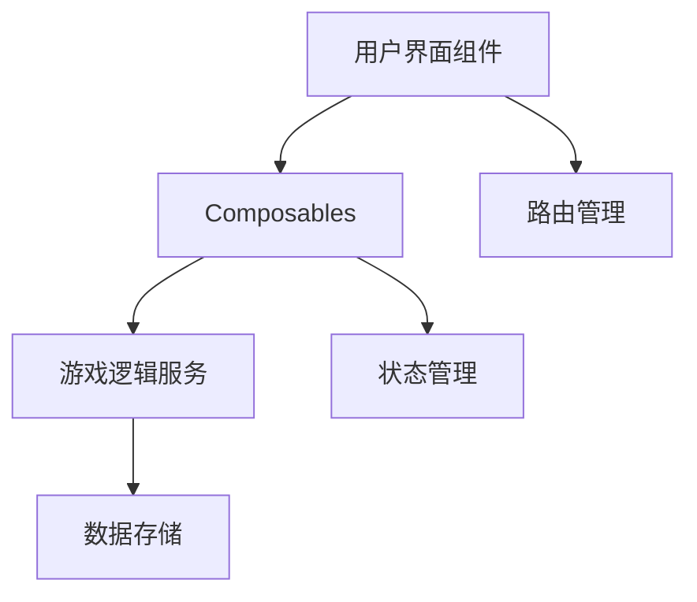
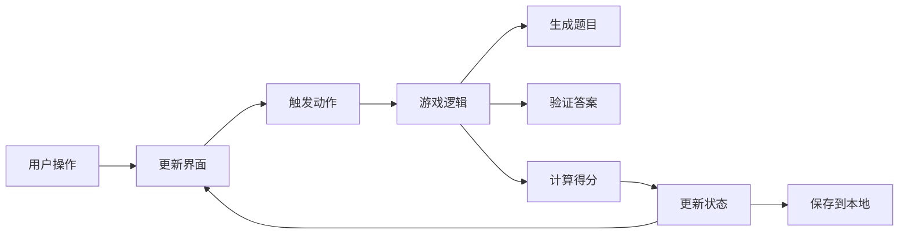

## 产品概述

一个帮助儿童学习数学运算的教育游戏，通过循序渐进的难度设计，让孩子在玩乐中掌握加减法运算。游戏采用鲜艳的色彩和友好的界面，适合儿童使用。

## 核心功能

- 15个难度等级，涵盖5个数值范围（1-3、1-5、1-10、1-20、1-100），每个范围包含加法、减法、加减混合三个阶段
- 题目随机生成，确保每次游戏体验不同
- 实时答题反馈，答对显示正确提示并加分，答错显示正确答案
- 游戏计时功能，记录完成时间
- 本地存储最佳成绩和游戏进度
- 语音播报功能（可选），读出题目和反馈
- 适配移动端和桌面端，支持触摸和键盘操作

## 技术栈

- 前端框架：Vue 3 + Vite
- 编程语言：JavaScript
- 构建工具：Vite
- 状态管理：Vue 3 Composition API（ref, reactive, computed）
- 代码组织：Composables 模式
- 样式方案：CSS（可选择 Tailwind CSS 或原生 CSS）
- 数据持久化：LocalStorage
- 语音合成：浏览器原生 Speech Synthesis API

## 架构设计

### 系统架构

采用 MVVM 架构模式，将视图（Vue 组件）、视图模型（Composables）和模型（游戏逻辑）分离。



### 模块划分

**核心模块：**

1. **难度配置模块**（difficulty-config.js）

- 定义15个难度等级的配置
- 包含数值范围、运算类型、题目数量等

2. **题目生成模块**（question-generator.js）

- 负责生成随机算术题
- 确保减法结果为非负数
- 根据难度调整题目复杂度

3. **游戏状态模块**（useGame.js - Composable）

- 管理当前游戏状态
- 计分系统
- 进度追踪

4. **数据持久化模块**（useStorage.js - Composable）

- 保存和读取最佳成绩
- 存储用户进度

5. **语音播报模块**（useSpeech.js - Composable）

- 文字转语音功能
- 播报题目和反馈

### 数据流



### 目录结构

```
math-game/
├── public/
│   └── favicon.ico
├── src/
│   ├── assets/           # 静态资源
│   ├── components/        # 可复用组件
│   │   ├── GameHeader.vue
│   │   ├── QuestionCard.vue
│   │   ├── DifficultyCard.vue
│   │   ├── ScoreBoard.vue
│   │   └── ResultModal.vue
│   ├── composables/       # Composables 函数
│   │   ├── useGame.js     # 游戏核心逻辑
│   │   ├── useStorage.js  # 本地存储
│   │   └── useSpeech.js   # 语音播报
│   ├── config/            # 配置文件
│   │   └── difficulty.js  # 难度配置
│   ├── utils/             # 工具函数
│   │   └── generator.js   # 题目生成器
│   ├── pages/             # 页面组件
│   │   ├── Home.vue
│   │   ├── DifficultySelect.vue
│   │   └── Game.vue
│   ├── App.vue
│   ├── main.js
│   └── router.js          # 路由配置
├── package.json
└── vite.config.js
```

### 关键代码结构

**难度配置示例：**

```javascript
// src/config/difficulty.js
export const DIFFICULTY_LEVELS = [
  { id: 1, range: [1, 3], operation: 'add', count: 10 },
  { id: 2, range: [1, 3], operation: 'subtract', count: 10 },
  { id: 3, range: [1, 3], operation: 'mixed', count: 10 },
  // ... 共15个等级
]
```

**Composable 示例：**

```javascript
// src/composables/useGame.js
import { ref, computed } from 'vue'

export function useGame(difficulty) {
  const currentQuestion = ref(null)
  const score = ref(0)
  const currentIndex = ref(0)
  
  const isComplete = computed(() => currentIndex.value >= difficulty.count)
  
  function startGame() { /* 开始游戏逻辑 */ }
  function checkAnswer(answer) { /* 验证答案逻辑 */ }
  
  return {
    currentQuestion,
    score,
    currentIndex,
    isComplete,
    startGame,
    checkAnswer
  }
}
```

### 技术实现要点

**1. 题目生成算法**

- 确保减法结果为正数或零
- 加法结果不超过数值范围上限
- 混合运算时随机选择加或减

**2. 状态管理**

- 使用 Vue 3 响应式 API 管理游戏状态
- 通过 computed 派生出需要的状态

**3. 本地存储**

- 使用 localStorage 保存最佳成绩
- 按难度等级分别记录

**4. 响应式设计**

- 使用 CSS Grid/Flexbox 实现响应式布局
- 支持移动端触摸操作

### 性能优化

- 使用 Vue 的虚拟 DOM 提升渲染效率
- 合理使用 computed 缓存计算结果
- 按需加载路由组件
- 图片和资源优化

### 安全考虑

- 输入验证，确保答案为数字
- 防止 XSS 攻击（使用 Vue 的模板转义）
- 本地存储数据加密（可选）

## 设计风格

采用儿童友好的设计风格，色彩鲜艳明快，元素圆润可爱。界面简洁清晰，避免过多干扰元素。使用大按钮和卡片式布局，方便儿童点击和识别。添加适当的动画反馈，增强游戏趣味性。

## 页面规划

### 1. 主页

- 游戏标题和可爱的数学图标
- "开始游戏"大圆形按钮
- "查看最佳成绩"入口
- 简单的背景装饰元素（数字、几何图形）

### 2. 难度选择页

- 显示15个难度等级，按数值范围分组
- 每个难度以卡片形式展示
- 显示进度条（已完成/未完成）
- 点击卡片进入游戏

### 3. 游戏页

- 顶部显示当前难度等级和进度
- 大字号显示算术题（如 2 + 3 = ?）
- 数字键盘（0-9）和清除按钮
- 实时显示得分和剩余题目数
- 答对/答错的视觉反馈动画

### 4. 结果页

- 显示总分和用时
- 星级评价（1-3星）
- "再玩一次"按钮
- 返回主页按钮
- 鼓励性评语

## 响应式设计

- 桌面端：居中显示，最大宽度限制
- 移动端：全屏显示，按钮更大，方便触摸
- 平板端：介于两者之间的适配