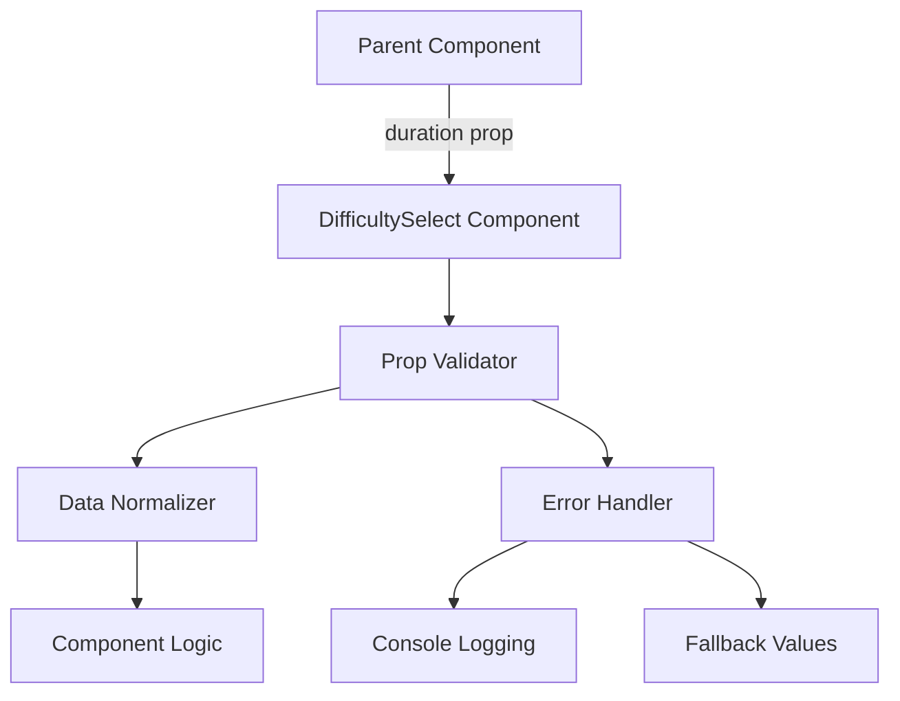

# Design Document: Prop Validation Fix

## Overview

This design addresses the Vue prop validation warning in the DifficultySelect component where the `duration` prop expects a Number but receives an Object. The solution involves implementing flexible prop validation that can handle multiple data types while maintaining type safety and providing clear error handling.

The approach uses Vue 3's custom validator functions combined with data normalization to ensure the component works correctly regardless of the input format, while providing meaningful feedback for debugging.

## Architecture

### Component Structure



### Data Flow

1. **Input Reception**: Parent component passes duration data (Object or Number)
2. **Validation**: Custom validator checks data type and structure
3. **Normalization**: Data normalizer converts Object to Number if needed
4. **Processing**: Component uses normalized Number value
5. **Error Handling**: Invalid data triggers fallback mechanisms

## Components and Interfaces

### DifficultySelect Component Enhancement

**Current State Analysis:**
- Component expects `duration` prop as Number type
- Receiving Object instead, causing validation failure
- Need to maintain backward compatibility

**Enhanced Prop Definition:**
```javascript
const props = defineProps({
  duration: {
    type: [Number, Object],
    validator: (value) => {
      // Custom validation logic
      if (typeof value === 'number') {
        return value >= 0;
      }
      if (typeof value === 'object' && value !== null) {
        // Check if object has duration-related properties
        return hasValidDurationProperties(value);
      }
      return false;
    },
    default: () => 30 // Default 30 seconds
  }
})
```

### Data Normalizer Utility

**Purpose:** Convert various duration formats to consistent Number type

**Interface:**
```javascript
/**
 * Normalizes duration data to a number value
 * @param {number|object} duration - Duration data in various formats
 * @returns {number} Normalized duration in seconds
 */
function normalizeDuration(duration) {
  // Implementation details in next section
}
```

### Validator Helper Functions

**Duration Property Checker:**
```javascript
/**
 * Validates if object contains valid duration properties
 * @param {object} obj - Object to validate
 * @returns {boolean} True if object has valid duration data
 */
function hasValidDurationProperties(obj) {
  // Check for common duration property patterns
}
```

## Data Models

### Duration Data Formats

**Expected Input Formats:**

1. **Number Format (Legacy):**
   ```javascript
   duration: 30 // seconds
   ```

2. **Object Format (Current Issue):**
   ```javascript
   duration: {
     value: 30,
     unit: 'seconds'
   }
   // OR
   duration: {
     seconds: 30
   }
   // OR
   duration: {
     duration: 30,
     // other properties...
   }
   ```

3. **String Format (Potential):**
   ```javascript
   duration: "30" // parseable to number
   ```

### Normalized Output Format

**Consistent Number Output:**
```javascript
// All inputs normalize to:
duration: 30 // number in seconds
```

## Implementation Strategy

### Phase 1: Investigation and Analysis

1. **Component Analysis:**
   - Examine DifficultySelect.vue prop definitions
   - Identify all parent components passing duration props
   - Analyze the actual Object structure being passed

2. **Data Source Identification:**
   - Trace data flow from configuration files
   - Check difficulty level definitions
   - Identify transformation points in data pipeline

### Phase 2: Prop Validation Enhancement

1. **Custom Validator Implementation:**
   ```javascript
   // Enhanced prop definition with custom validator
   const props = defineProps({
     duration: {
       type: [Number, Object, String],
       validator(value) {
         return validateDurationProp(value);
       },
       default: () => 30
     }
   })
   ```

2. **Validation Logic:**
   - Accept Number, Object, and String types
   - Validate Object structure for duration properties
   - Ensure non-negative values
   - Provide detailed error messages

### Phase 3: Data Normalization

1. **Normalizer Function:**
   ```javascript
   function normalizeDuration(duration) {
     if (typeof duration === 'number') {
       return Math.max(0, duration);
     }

     if (typeof duration === 'string') {
       const parsed = parseFloat(duration);
       return isNaN(parsed) ? 30 : Math.max(0, parsed);
     }

     if (typeof duration === 'object' && duration !== null) {
       // Extract numeric value from object
       return extractDurationFromObject(duration);
     }

     return 30; // fallback
   }
   ```

2. **Object Property Extraction:**
   - Check for `value`, `seconds`, `duration` properties
   - Handle nested object structures
   - Provide sensible fallbacks

### Phase 4: Error Handling and Logging

1. **Development Warnings:**
   ```javascript
   if (process.env.NODE_ENV === 'development') {
     console.warn(`DifficultySelect: Unexpected duration format:`, duration);
   }
   ```

2. **Graceful Degradation:**
   - Use fallback values for invalid data
   - Maintain component functionality
   - Log issues for debugging

Based on my prework analysis, I can now write the correctness properties:

**Property 1: Duration input format handling**
*For any* valid duration input (Number, Object with duration properties, or parseable String), the normalization function should extract a valid non-negative number value
**Validates: Requirements 2.1, 2.4, 3.1, 3.2**

**Property 2: Validation and error handling**
*For any* input to the duration prop validator, valid inputs should pass validation without warnings, and invalid inputs should be gracefully rejected with appropriate fallback behavior
**Validates: Requirements 2.2, 2.3, 4.2, 5.1, 5.2**

**Property 3: Fallback behavior consistency**
*For any* invalid or missing duration input, the system should always provide the same sensible default value and maintain component functionality
**Validates: Requirements 3.3, 4.4**

**Property 4: Context independence**
*For any* given duration input value, the normalization and validation should produce identical results regardless of the difficulty level or component context
**Validates: Requirements 3.4**

## Error Handling

### Validation Error Strategy

**Graceful Degradation Approach:**
- Invalid inputs trigger fallback to default values
- Component continues functioning normally
- Development warnings logged for debugging
- No runtime crashes or broken UI states

**Error Categories:**

1. **Type Mismatch Errors:**
   ```javascript
   // Handle unexpected types gracefully
   if (typeof duration !== 'number' && typeof duration !== 'object') {
     console.warn('DifficultySelect: Invalid duration type:', typeof duration);
     return DEFAULT_DURATION;
   }
   ```

2. **Object Structure Errors:**
   ```javascript
   // Handle malformed objects
   if (typeof duration === 'object' && !hasValidDurationProperties(duration)) {
     console.warn('DifficultySelect: Object missing duration properties:', duration);
     return DEFAULT_DURATION;
   }
   ```

3. **Value Range Errors:**
   ```javascript
   // Handle negative or invalid numeric values
   if (normalizedValue < 0 || isNaN(normalizedValue)) {
     console.warn('DifficultySelect: Invalid duration value:', normalizedValue);
     return DEFAULT_DURATION;
   }
   ```

### Development vs Production Behavior

**Development Mode:**
- Detailed console warnings with object inspection
- Stack traces for debugging
- Verbose error messages

**Production Mode:**
- Silent fallback to defaults
- Minimal console output
- Focus on user experience continuity

## Testing Strategy

### Dual Testing Approach

Since this project has **no tests configured** according to AGENTS.md, the testing strategy will focus on manual testing and validation during development, with the structure prepared for future test implementation.

**Manual Testing Requirements:**
- Test all duration input formats (Number, Object, String)
- Verify console warnings appear in development mode
- Confirm component renders without errors
- Validate fallback behavior with invalid inputs

**Future Property-Based Testing (when tests are added):**
- Each correctness property should be implemented as a property-based test
- Minimum 100 iterations per property test
- Use a JavaScript property-based testing library like fast-check
- Tag format: **Feature: prop-validation-fix, Property {number}: {property_text}**

**Unit Testing Balance:**
- Property tests handle comprehensive input coverage
- Unit tests focus on specific examples and edge cases
- Integration tests verify component behavior in parent contexts

**Test Configuration (Future):**
```javascript
// Example property test structure for when testing is added
describe('DifficultySelect Duration Prop', () => {
  test('Property 1: Duration input format handling', () => {
    // Feature: prop-validation-fix, Property 1: Duration input format handling
    // Test with 100+ random valid inputs
  });
});
```
