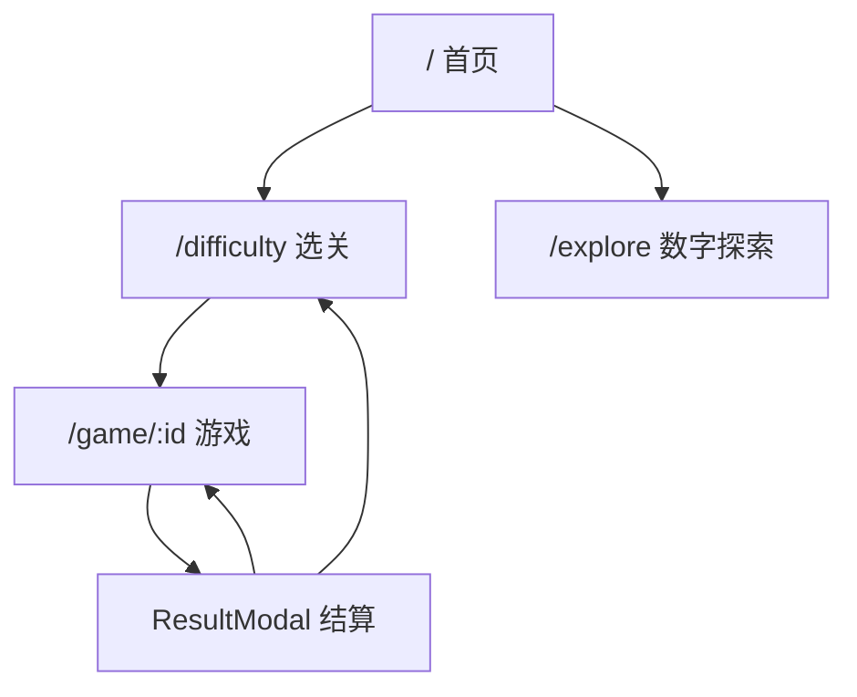
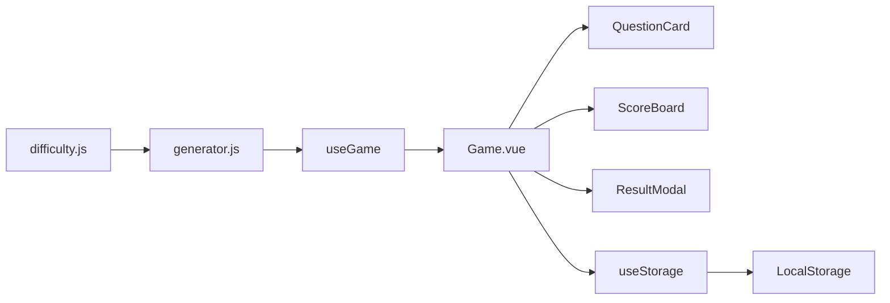

# 数感闯关项目架构

> 软件全称：数感闯关儿童数学启蒙训练软件｜产品简称：数感闯关｜软件版本：V1.0

本文描述数感闯关儿童数学启蒙训练软件的当前运行时结构。源码与配置优先于历史设计稿。

## 运行时结构

应用由 Vue 3、Vue Router 和 Vite 构建，不使用后端服务、Pinia 或 TypeScript。



路由组件均采用动态导入。未知路径重定向到首页。

## 游戏数据流



`useGame` 负责：

- 根据关卡配置生成或准备题目
- 当前题目、索引、分数、正确数、错题和逐题作答结果
- 正确率、整轮耗时，以及从题目出现到提交答案的逐题耗时
- 正常回合与指定错题列表重新开局

`Game.vue` 负责：

- 输入节流、提交和反馈时序
- 正确答案自动推进，错误答案手动确认
- 连对提示、振动和音效触发
- 正常结算、重新开始和错题重练
- 从本关本地薄弱账本读取题目并传给正常组卷
- 小球辅助偏好持久化

题目卡本身保持稳定，只对算式内容执行轻量切换动画，避免换题时卡片和数字键盘跳位。

## 用户玩法规则

- 软件包含两种模式：主线闯关用于递进式加减训练，数字探索用于 1–1000 的十进制数量观察和猜数练习。
- 主线共 26 关，必须按顺序解锁；第 1 关默认开放。
- 每关完成全部配置题目后结算，正确率达到 85% 即为通过。
- 正确答案自动进入下一题；错误答案展示正确结果，等待用户确认后再继续。
- 结算页支持查看错题、重新开始和仅重练错题。错题重练不改变最佳成绩、解锁状态或计时榜。
- 有尚未掌握的薄弱记录时，正常回合约 50% 题目来自本关错题、慢题或同题型变式，不提供额外训练入口或题目标签。
- 数字探索独立于主线关卡，提供 1–1000 自由查看和按数量范围的猜数挑战，不写入主线通关进度。

## 题目生成

关卡事实来源：

- `src/config/difficulty.js`：26 个关卡、分组、题量和阶段
- `src/utils/generator.js`：候选题池、阶段分段和抽题策略

常规关卡先按热身、核心、挑战约 `40% / 40% / 20%` 生成基础题目，部分综合关卡使用专门的题型配比。若本关存在尚未掌握的薄弱记录，最终组卷将其中 50% 替换为薄弱题及同题型变式；薄弱部分按约 50% 错题、50% 慢题抽取，并随机分散。某类记录不存在时由另一类补足。所有题目通过 `prepareQuestion()` 补齐 `id`、`result`、`missingPart` 和作答状态。

## 持久化

`useStorage` 使用模块级 `shallowRef` 缓存 LocalStorage 数据，并监听 `storage` 事件同步其他标签页。

`math-game-data` 当前结构：

```javascript
{
  bestScores: {
    [difficultyId]: {
      score,
      correctCount,
      totalCount,
      accuracy,
      duration,
      durationMs,
      completedAt
    }
  },
  leaderboards: {
    [difficultyId]: [
      { durationMs, completedAt, totalCount }
    ]
  },
  progress: {},
  stats: {
    totalAnswers,
    totalCorrect,
    mistakeLedger,
    difficultyStats: {
      [difficultyId]: {
        avgTime,
        totalPlayed,
        avgResponseTimeMs,
        responseSampleCount
      }
    },
    weakQuestionLedger: {
      [questionKey]: {
        question,
        difficultyId,
        wrongCount,
        slowCount,
        correctStreak,
        totalAttempts,
        lastAnswer,
        lastSeenAt
      }
    }
  }
}
```

关键规则：

- 通过线为 `85%`。
- 完成状态由最佳成绩正确率推导。
- 每关保存前 10 名计时记录。
- 慢题按本关历史逐题均值的 `1.5` 倍识别，并设 `5s` 最低阈值；首次记录使用本轮正确题中位数作为基线。
- 薄弱题连续 3 次快速答对后不再作为自身的强化来源；它仍可能由正常组卷或其他薄弱题的同类变式选中。再次答错或慢答会重置连续正确次数。
- 错题重练会更新薄弱掌握情况，但不写入累计答题数、最佳成绩、解锁状态、关卡速度统计或计时榜。
- 榜单按当前关卡 `questionCount` 过滤，不混用不同题量的成绩。
- 无 `totalCount` 的旧榜单条目无法确认可比性，不显示在当前榜单。
- 旧版或部分损坏的统计结构会在读取时补齐默认字段。

## 小球辅助

`QuestionCard.vue` 承载开关，`NumberBondHint.vue` 负责图形：

- 加法：两组不同颜色的小球。
- 减法：保留与划掉的小球。
- 缺项加法：实心表示已知，空心表示未知。
- 每行 10 个位置，最多渲染 30 个，超出部分显示 `+N`。
- 默认关闭，偏好保存在 `math-game-number-bond-hint-enabled`。

## 数字探索

`NumberExplore.vue` 管理自由探索和范围挑战；`BallArray.vue` 使用 Three.js 渲染 1-1000。

- X、Y、Z 方向分别表达个位、十位和百位层次。
- 移动端默认缓慢自动旋转并保留页面滚动。
- 桌面端通过 OrbitControls 支持旋转和缩放。
- `three` 在 Vite 构建中单独拆包。

## 音频与触觉

`useSound.js` 集中管理单例 AudioContext：

- 交互音效由振荡器生成。
- master gain 和 low-pass filter 统一控制输出。
- 各音效有独立冷却时间。
- 页面恢复时尝试恢复被中断的音频上下文。
- 结算语音来自 `public/audio/praise/*.mp3`，每轮只播放一个主反馈。

音效和振动默认开启，目前没有设置开关。Vibration API 不可用时静默降级。

## PWA

PWA 只有一条实现链：

1. `vite-plugin-pwa` 在构建时生成 Workbox Service Worker。
2. `public/manifest.json` 提供应用清单。
3. `PWAUpdatePrompt.vue` 使用 `virtual:pwa-register` 提示用户刷新。

开发环境不启用 Service Worker。详细配置见 [`../PWA.md`](../PWA.md)。

## 测试与 CI

- 包管理器：pnpm 11，依赖锁定文件为 `pnpm-lock.yaml`
- Vitest：`tests/unit/`
- Playwright：`tests/e2e/smoke.spec.js`
- 构建与单测：`.github/workflows/ci.yml`
- E2E：`.github/workflows/e2e-smoke.yml`

Playwright 配置包含 Pixel 7 和 iPhone 13 两套移动设备参数，但当前未显式配置 WebKit，CI 也只安装 Chromium。因此 E2E 是两套移动端 Chromium 模拟，不能替代 iOS Safari 真机验证。

## 无障碍交互

- `App.vue` 提供跳到主内容的链接，各路由页暴露唯一主内容目标。
- 选关使用原生按钮语义，支持键盘选择并明确播报锁定状态。
- 错误反馈、结算和 PWA 更新使用对话框语义；模态界面打开时隔离背景、约束焦点，关闭后恢复焦点。
- Toast、加载和答题状态通过 live region 播报。
- Three.js 球阵提供数量及十进制位值拆解的文字替代。

浏览器缩放保持可用；触摸优化不得通过 viewport 或脚本禁用缩放。
