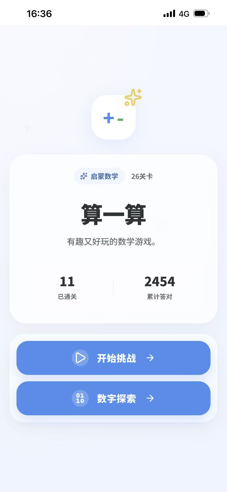
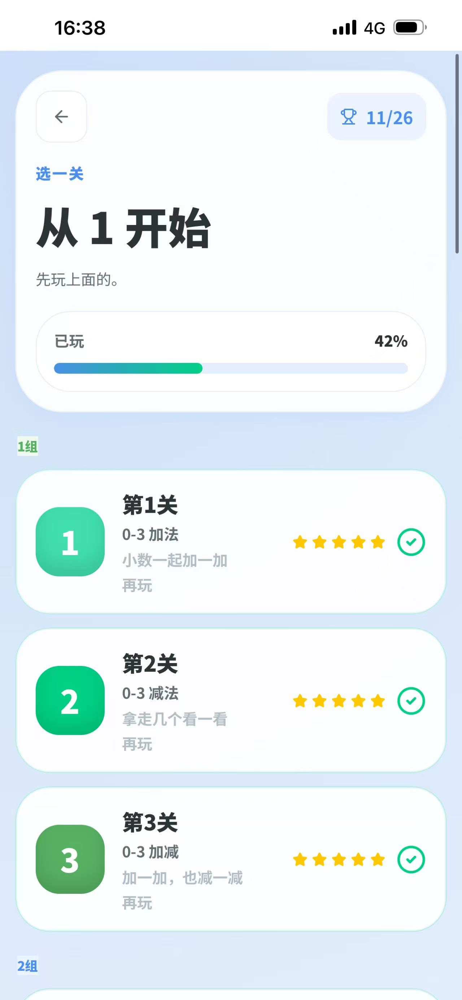
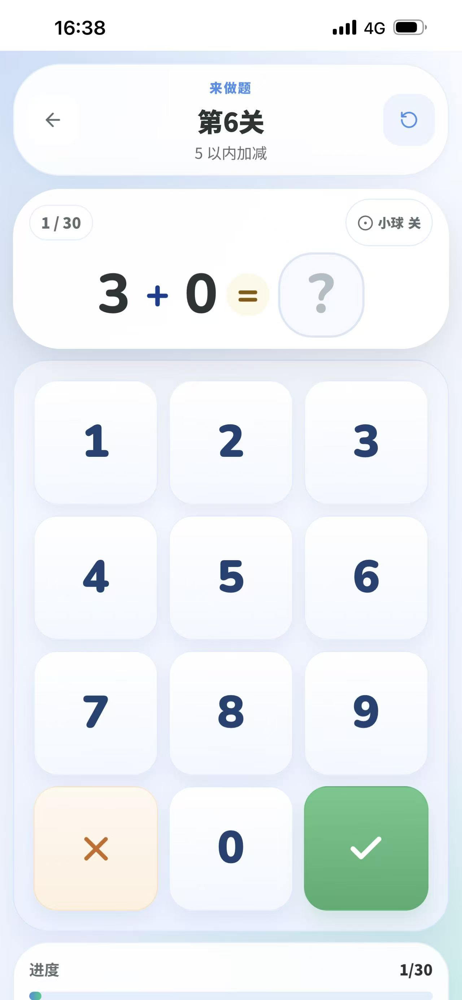
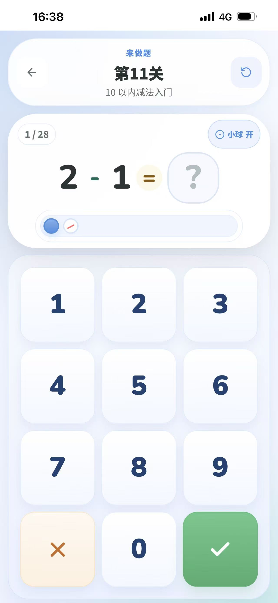
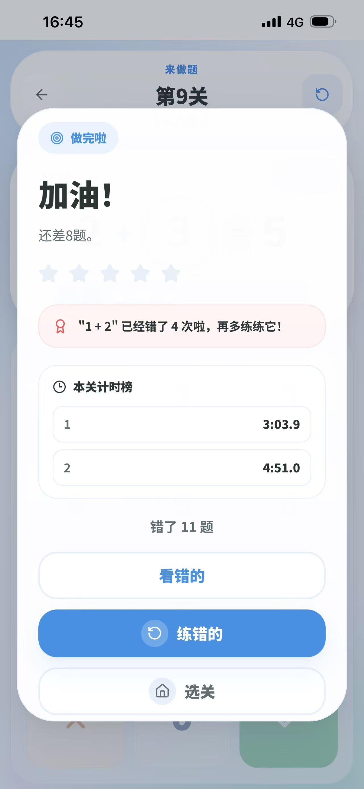
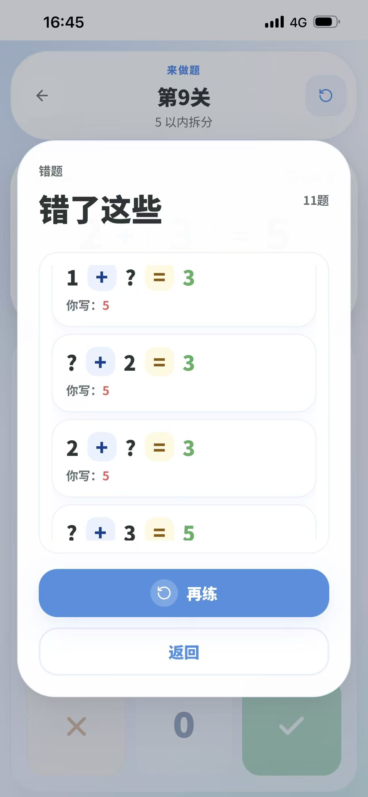
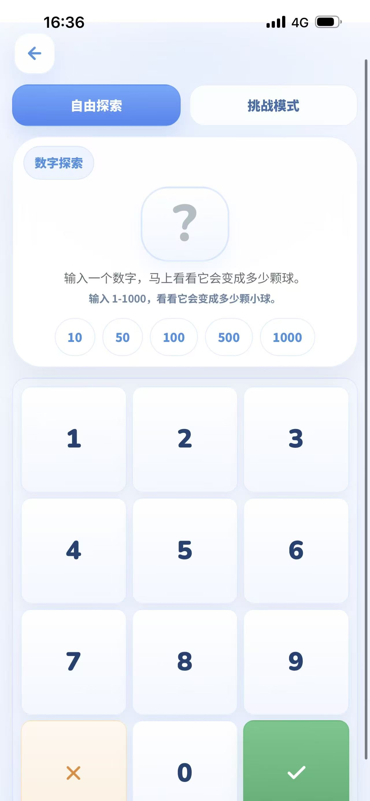
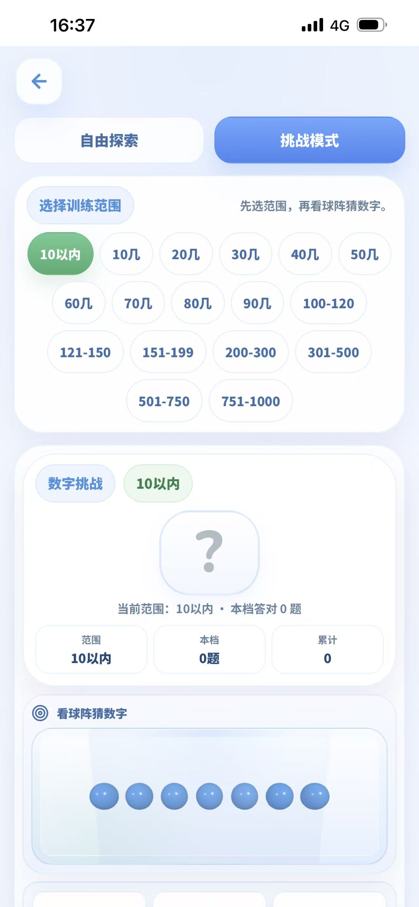
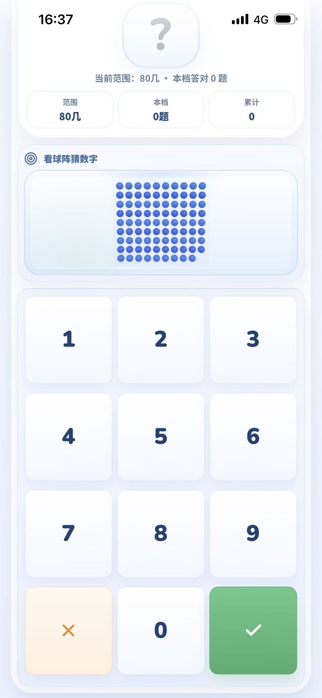

# 数学运算游戏操作手册

## 一、相关文档

| 文档名称 | 指向资料 | 说明 |
| --- | --- | --- |
| 总体设计 | 《总体设计》 | 说明软件整体功能、页面组成、运行环境和业务边界。 |
| 详细设计 | 《详细设计》 | 说明各功能页面、输入输出、状态变化和处理规则。 |
| 测试案例 | 《测试案例》 | 记录主要功能的操作场景、预期结果和异常提示。 |

## 二、说明

数学运算游戏 V1.0.0 是一款面向学龄前儿童和小学低年级学生的数学启蒙训练软件，主要用于帮助用户在移动端环境下完成循序渐进的加减法练习和数量感训练。软件把练习过程划分为主线闯关和数字探索两条主要使用路径，既适合家庭日常练习，也适合课堂后的巩固训练。

用户打开软件后，可以先从首页进入关卡训练，也可以直接进入数字探索。进入主线训练后，用户先在选关页查看已解锁关卡和当前进度，再进入具体关卡逐题作答，系统在答题过程中给出即时反馈，并在整关结束后展示正确率、用时和错题情况。选择数字探索时，用户可以输入 1 到 1000 的数字查看对应球阵，也可以切换到挑战模式进行区间猜数训练。

软件的核心价值在于把抽象的运算题、找缺口题和数量关系练习转换为适合儿童理解的页面交互过程。用户不需要依赖复杂设置，只需按照页面提示点击、输入和确认，即可完成练习、查看结果并继续下一轮训练。本手册按照用户实际看到的页面顺序，对软件用途、运行要求和操作流程进行说明。

## 三、功能特点

软件采用 26 个主线关卡组成渐进式训练路径，练习内容从 0-3 加减法逐步扩展到 20 以内综合训练。每一关都对应明确的题量、范围和教学重点，用户必须按顺序通过上一关后才能解锁下一关，适合按阶段持续练习。

练习页面使用数字键盘完成作答，系统在提交答案后即时给出反馈。答对时自动进入下一题，答错时会停留在当前反馈状态，先展示正确答案，再等待用户确认后继续。这种处理方式既保持练习节奏，也能让用户在错误发生时及时看到正确结果。

软件支持错题复练和本地成绩追踪。用户完成一关后，可以查看本轮错题列表，并只针对错误题目重新开始新一轮练习。软件还会保存每关最佳成绩、计时榜和累计答题统计，但错题重练不会覆盖正式闯关成绩，能够同时兼顾训练和记录两类需求。

除主线闯关外，软件还提供数字探索功能。用户可以在自由探索模式中输入 1 到 1000 的数字查看十进制球阵，也可以在挑战模式中根据不同数量区间进行猜数训练。该功能适合帮助儿童理解百、十、个的数量构成，并通过可视化方式建立数量感。

软件支持移动端触控使用和本地离线记录。页面按钮尺寸适合手机竖屏点击，进度、成绩和小球辅助偏好会保存在本机浏览器中，用户再次进入软件时可以继续查看原有数据。结合 PWA 能力，软件还可以提供安装、缓存和更新提示，方便在稳定场景下长期使用。

## 四、系统要求

| 系统要求 | 最低配置 | 推荐配置 |
| --- | --- | --- |
| 操作系统 | Android 10、iOS 15 或 Windows 10 | Android 13、iOS 17 或 macOS 14 |
| 浏览器或客户端 | Chrome 120、Safari 15 或 Edge 120 | 最新版 Chrome、Safari 或已安装的 PWA 应用 |
| 网络环境 | 首次加载需要可访问界面资源的网络环境 | 联网首次访问后可结合 PWA 缓存提升后续使用稳定性 |

请确保实际运行环境满足以上要求，以保证数学运算游戏能够正常打开页面、提交操作和展示处理结果。若部署方式、客户端形态或服务器环境与本表不同，应以实际确认的申请表环境字段为准。

## 五、首页入口

首页是软件的默认进入页面，主要用于展示训练入口、数字探索入口以及当前学习概况。用户打开软件后会先看到标题、引导语和两个主按钮，并可从这里决定下一步是开始闯关还是进入数量探索。

如果当前设备中已经存在历史练习记录，首页会显示已通关数量和累计答对题数；如果是第一次使用，则会显示开始第一关的提示语，帮助用户快速进入练习状态。

用户点击“开始挑战”后会进入关卡选择页面，点击“数字探索”后会进入数字探索页面。两个按钮都采用直接跳转方式，适合儿童在较少阅读说明的情况下快速进入对应功能。

正常使用时，用户先查看首页显示的学习数据和入口按钮，再点击目标按钮进入下一页。页面对短时间内的重复点击做了处理，避免重复跳转。进入下一页后，首页本身不会再弹出额外确认框，整体操作过程比较直接。



## 六、关卡选择页面

关卡选择页面用于展示全部主线关卡、当前已解锁进度和每关成绩信息。用户从首页点击“开始挑战”后进入该页，可以按阶段查看不同关卡的训练重点和当前完成情况。

页面顶部会显示已通关数量、整体进度条和返回首页按钮。向下浏览时，用户会看到按阶段分组排列的关卡卡片，每张卡片会显示关卡名称、锁定状态、完成状态以及相关成绩信息。

如果某一关尚未解锁，用户只能查看关卡信息，不能直接进入作答页面；如果上一关已经通过，对应下一关会自动开放。对于已完成的关卡，用户还可以看到本地保存的最佳成绩和与当前题量一致的计时榜结果。

正常操作时，用户先查看页面顶部进度，再浏览目标阶段的关卡卡片，点击已解锁关卡即可进入练习。若用户中途返回首页，再次进入该页时，页面会尽量恢复之前的浏览位置，便于继续查看后面的关卡。



## 七、关卡练习与作答

关卡练习与作答页面是软件的核心页面，负责展示题目、接收答案、给出反馈并推进整关进度。用户在关卡选择页点击某一已解锁关卡后，即可进入该页面开始练习。

页面中会显示当前题目、题号、答案输入区、数字键盘以及必要时可开启的小球辅助。用户根据题面输入答案后点击确认，系统会立刻判断正误，并以不同方式处理后续流程。

如果答案正确，系统会播放正确反馈并在短暂停留后自动切换到下一题，避免频繁额外点击；如果答案错误，页面会展示正确答案和错误反馈，用户需要主动确认后才能继续下一题。这种机制既保留了节奏，也给用户留下观察错误结果的时间。

在实际使用中，用户先查看题目和当前输入状态，再通过数字键盘输入答案，必要时使用删除键修改输入内容，然后点击确认键提交。未输入数字时系统会提示先输入答案；输入和提交操作也设置了短间隔限制，避免重复触发。整关所有题目完成后，页面会自动进入结算界面。





## 八、结算结果与错题重练

结算结果与错题重练页面会在用户完成当前关卡全部题目后自动显示，用于汇总本轮成绩、判断是否通过，并提供重新开始或错题重练入口。

该页面会展示正确率、用时、星级、新纪录提示、计时榜信息和错题列表。用户可以据此判断自己本轮的练习效果，并决定是继续强化还是返回选关页。

当正确率达到 85% 时，系统会把该关视为通过，并在满足条件时解锁下一关；如果本轮成绩刷新了最佳记录，页面也会给出相应提示。若用户选择“仅重练错题”，系统只会载入本轮答错的题目重新开始，不会把该轮成绩计入正式榜单。

通常情况下，用户先查看结算面板中的正确率和通过结果，再根据页面中的按钮选择重新开始、仅重练错题或返回关卡页。整个页面以结果查看和下一步决策为主，不需要再次输入答案。





## 九、数字探索-自由探索

数字探索的自由探索模式用于让用户输入 1 到 1000 的数字，并直观看到对应的小球数量结构，帮助理解百、十、个的构成关系。用户从首页点击“数字探索”后，默认进入该模式。

页面中会显示数字输入区、数字键盘、快捷数量按钮、状态提示文字、球阵展示区域和数量构成说明。与主线闯关不同，这个页面不强调通过与否，而是强调观察和理解数字对应的数量表现。

用户可以直接通过数字键盘输入目标数字，也可以点击快捷数量按钮快速查看 10、50、100、500、1000 等典型数量。点击确认后，页面会显示对应的小球阵列和数量说明，便于用户观察当前数字由几个百、几个十和几个一组成。

输入范围限制为 1 到 1000，0 不能单独作为有效输入，超出范围时系统会提示用户调整。用户在结果页中还可以继续浏览相邻数量，或返回输入状态重新选择新的数字。



## 十、数字探索-挑战模式

挑战模式用于训练用户对不同数量区间的观察和估算能力。用户在数字探索页点击“挑战模式”按钮后，页面会切换到区间挑战状态。

在该模式下，页面会展示当前挑战范围、数字输入区、球阵结果区和状态提示。用户需要先观察球阵或区间提示，再输入自己猜测的数字，随后由系统给出是否猜中的反馈。

系统会按照预设范围生成目标数量，例如 10 以内、20 几、50 几或更高区间。用户猜对后，页面会提示正确并累计当前档位的答对数量；若猜错，系统会显示正确答案，帮助用户把视觉印象和真实数量对应起来。

正常操作时，用户先选择或保持当前挑战区间，再输入猜测数字并提交结果。猜测数字同样必须在 1 到 1000 范围内；切换挑战区间时，当前档位的答对数量会重新计算。每轮反馈结束后，用户可以继续下一题，也可以重新练习当前范围。





## 十一、典型使用流程

用户完成一次完整练习时，通常先进入首页，再点击“开始挑战”进入关卡选择页面。查看已解锁关卡和当前进度后，用户进入目标关卡逐题作答，系统在每题提交后给出正确或错误反馈。整关结束后，用户在结算页查看正确率、用时和错题情况，并根据需要选择重新开始、仅重练错题或返回选关页。

如果用户希望进行数量感训练而不是正式闯关，可以从首页进入数字探索页面，在自由探索模式中输入数字查看球阵，或切换到挑战模式进行区间猜数训练。两条使用路径互不干扰，用户可根据当天的训练目的自由选择。

## 十二、常见问题解答

问题：为什么下一关还是锁定状态？
解决方法：只有在当前关卡完成全部题目且正确率达到 85% 后，下一关才会自动解锁。如果本轮未达到通过线，需要重新完成当前关卡。

问题：为什么错题重练后没有刷新最佳成绩？
解决方法：错题重练用于针对性巩固错误题目，不参与正式闯关成绩和计时榜比较，因此不会更新最佳成绩或排名。

问题：数字探索里为什么不能输入 0 或超过 1000 的数字？
解决方法：当前探索功能的设计范围是 1 到 1000，用于对应固定的十进制球阵展示，因此超出范围或输入 0 时系统会给出提示。

问题：更换设备后为什么看不到以前的成绩？
解决方法：软件当前把学习进度和成绩保存在本机浏览器的本地存储中，不同设备或清空浏览器数据后不会自动同步历史记录。

## 十三、术语表

| 术语 | 解释 |
| --- | --- |
| 主线关卡 | 软件中按学习顺序排列的正式训练关卡，用户需要逐关通过后才能解锁后续内容。 |
| 错题重练 | 在结算页仅提取本轮答错的题目重新练习的功能，用于集中巩固薄弱点。 |
| 小球辅助 | 在部分题目中配合算式展示的小球数量图形，用来帮助用户理解加、减和缺项关系。 |
| 数字探索 | 通过输入数字或进行区间挑战来观察十进制球阵的功能，用于训练数量感和数字结构理解。 |
| 同题量计时榜 | 只比较与当前关卡题量一致的本地完成时间记录，避免不同题量的成绩直接混排。 |

```text
STOP_FOR_USER
NEXT_ACTION: 请一次性确认完整操作手册草稿是否符合真实业务；必要时先统一修改段落内容，再运行 confirm_stage.py --stage markdown。
```
